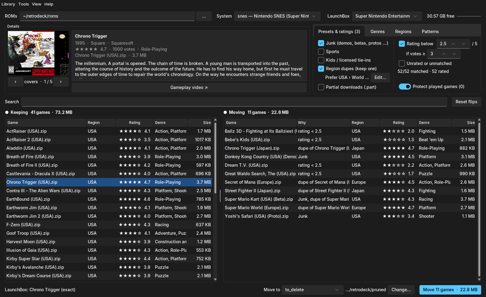
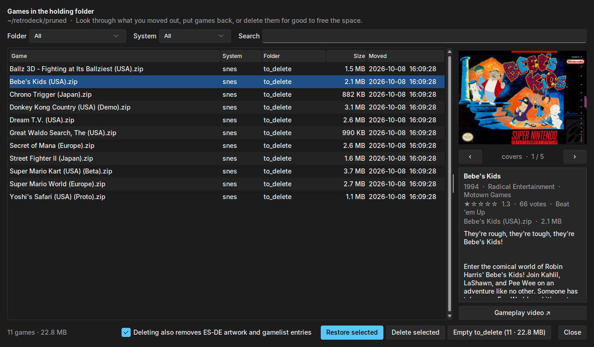
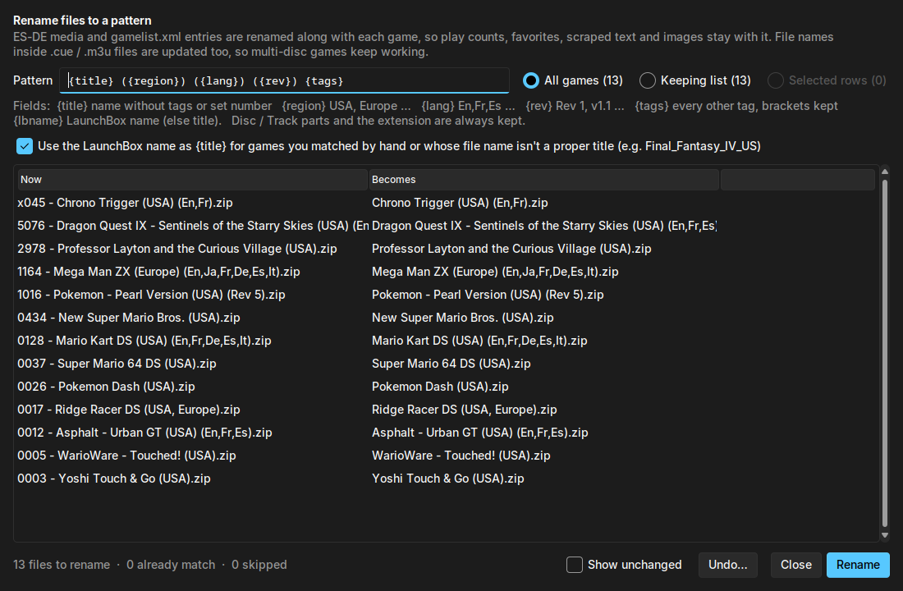
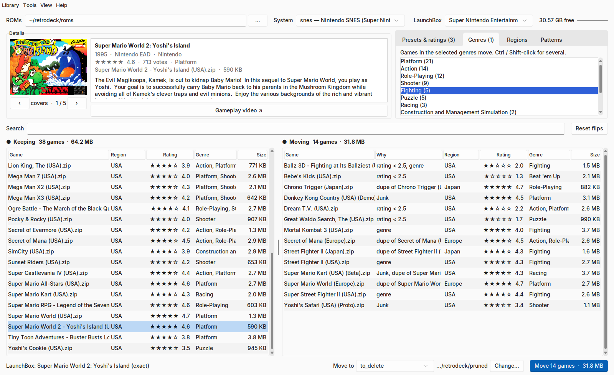

<p align="center"></p>

# RetroShelf

A desktop tool for tidying up an [ES-DE](https://es-de.org/) / [RetroDECK](https://retrodeck.net/) game library on
Linux or Windows. Point it at your `roms` folder, pick a system, and it helps you decide what to keep, fills in metadata and
artwork, gives your files consistent names, and installs PS3 / PS Vita / PSP games through NoPayStation.

Nothing is deleted unless you ask: pruned games are moved to a holding folder outside `roms`, every move and
rename can be undone, and games only go for good when you delete them from the holding folder.



## Features

**Prune your library**
- Two side-by-side lists, *Keeping* and *Moving*, that update live as you change filters.
- Shows how much space is free on the drive your ROMs are on.
- Filters sit in tabs (Presets & ratings, Genres, Regions, Patterns) whose names count what's switched on, so the
  layout fits a Steam Deck screen next to the details panel.
- Presets: junk (demos, betas, protos, kiosk, unlicensed), sports, kids / licensed tie-ins, and region duplicates
  (keeps one copy per game, using a region priority you can reorder).
- Name patterns with `*` / `?` wildcards and `!` keep rules.
- Filter by LaunchBox rating, vote count, genre and region.
- Played games are protected by default (play counts from ES-DE's `gamelist.xml`).
- Double-click any game to flip it by hand, or use the keyboard or a gamepad (**Help → Keyboard and gamepad**):
  - → or Delete moves the selected games and ← keeps them; the cursor stays where you were, so you can work
    down a list key by key. Ctrl+Z (or Backspace) undoes.
  - Space marks games without moving them yet, and steps to the next one. Marked games flip together on Enter or
    when you leave the list.
  - Type a few letters to jump to a game, Shift+↑/↓ selects a range, Ctrl+A everything shown, and Tab switches
    between Keeping and Moving, back where you were.
- Any standard gamepad works, with no Steam Input or extra software: D-pad or stick to move, A marks (Space), X flips
  (Enter), Y undoes, B closes, LB / RB switch lists, LT / RT page, Start opens Review. RetroShelf reads pads itself
  (Linux: `/dev/input`; Windows: XInput) and only while its window has the focus. **View → Use a gamepad** turns it
  off. On a Steam Deck, Steam keeps the built-in controls while it's running; other pads work.
  While the pad is what you're using, a bar along the bottom of the window shows the buttons that do something
  there, drawn the way your pad labels them (Xbox letters, PlayStation shapes or Nintendo letters), and what each
  does right now ("Mark", "Move 3 marked", "Keep", …). It goes away when you type or move the mouse.
  The View / Select button (F6 on a keyboard) goes from the lists to the search box to the filter tabs and back,
  and A in a text box opens an on-screen keyboard (D-pad to move, A types, Y deletes, LB for capitals, X when done).
- Each system goes back to the game you were on when you left it, after a restart too.
- **View → Review one at a time…** (Ctrl+R) goes through the list with each game's artwork and details:
  K (or Space) keeps, M (or Enter) moves, S skips, ← goes back, Backspace undoes.
- **Hide in ES-DE** (next to Move) is the gentler choice for the Moving list's games: they stay on disk and ES-DE
  leaves them out of its menus (it marks them hidden in its gamelist, and turns off ES-DE's "Show hidden games"
  if it's on). Hidden games stay in Keeping, like played ones, and show "hidden in ES-DE"; right-click →
  **Show in ES-DE again** undoes it.
- **Library → Save as an ES-DE collection…** (or right-click → **Add to an ES-DE collection…**) puts the Keeping
  list, the Moving list or the selected games into an ES-DE custom collection, new or existing ("Best of SNES",
  "Party games" …). ES-DE then shows it next to the systems; RetroShelf turns it on in ES-DE's settings when ES-DE
  isn't running.
- Each system remembers its patterns, filters and flips, so it opens the way you left it.
- Multi-file games (cue/bin, multi-disc + m3u) are treated as one game and moved together.
- **Library → Restore a move…** puts a whole batch of moved games back, including RPCS3 / Vita3K data that went with them.
- **Library → Holding folder…** lists everything you've moved out, with artwork and details. Put games back one by one,
  or delete them for good (with their ES-DE artwork and gamelist entries) to free the space.
- A details panel shows the selected game's artwork, LaunchBox description, year, developer,
  rating and genres, plus a button that searches YouTube for gameplay videos.

**Storage overview**
- **Library → Storage overview…** (or click the free-space figure at the top) shows how much each system takes:
  its games, its ES-DE media (artwork, videos, manuals), and how much of it is disc images that
  **Tools → Compress games** could shrink. Pick a system to see its biggest games. Double-click a system or a
  game to go to it in the main window.

**Import ROMs**
- **Import ROMs…** (top bar, or **Library → Import ROMs…**) is a bucket for games in whatever form you have them:
  zip / 7z / rar archives, disc images, loose ROMs, folders full of them. Put them in the `import` folder next to
  your `roms` folder (RetroShelf notices new files while the window is open), or add them from anywhere with
  **Add files…** / **Add a folder…** (which says how many games it found in the folder before listing them).
  A network share has to be mounted as a folder first (for example under `/mnt`).
- Each game's system is shown before anything moves, with how it was found: the file type when only one system
  uses it, the disc itself for images (PS2 and PS1 discs by their `SYSTEM.CNF`, PSP, GameCube, Wii, Saturn,
  Sega CD, Dreamcast, 3DO, PC Engine CD, Neo Geo CD, Xbox; `.cso`, `.rvz`, `.gcz`, `.pbp` and `.chd` too), or the
  folder name (`PS2`, `Sony - PlayStation 2`, …) when the file can't tell. Select any game to pick its system by hand.
- **Import** unpacks archives (7z needs nothing installed; rar and 7z's rarer methods use 7-Zip, unrar or bsdtar if
  you have one) and files the games into `roms/<system>`: a `.bin` without a `.cue` gets one, `.cue` / `.gdi` games
  keep their tracks together, full Xbox dumps are cut down to the part xemu reads, and arcade zips stay zipped under
  their set name. Readmes and tools inside archives are left out.
- Games unpack into a hidden staging folder first, so ES-DE never sees half a game, and the drive's free space is
  checked before a big archive is unpacked. Games from the import folder are moved out of it; games added from
  elsewhere are copied, unless you tick **Also delete the originals**.

**LaunchBox metadata**
- Downloads the free LaunchBox Games Database once and matches your games to it automatically.
- Right-click a game to pick its LaunchBox entry by hand when the match is missing or wrong.
- **Tools → Scrape metadata…** fills ES-DE text (description, developer, release date, genre, rating …) and images (covers,
  screenshots, title screens, marquees, 3D boxes …). It only fills gaps and never overwrites what's already there.

**Gameplay videos**
- The details panel and the review window play the selected game's gameplay clip, muted and looping, a moment
  after you land on it: 🔇 turns the sound on, ‹ › go back to the pictures. Clips are ES-DE's own, from its
  `videos` folder (ES-DE's scraper downloads them).
- For games without a clip, **View → … and stream from YouTube when there's no clip** plays the top YouTube result
  for "*title* *console* gameplay" instead, starting halfway in to skip past intros. It's off by default: it uses
  [yt-dlp](https://github.com/yt-dlp/yt-dlp) to play YouTube outside YouTube's own player, which YouTube's terms
  don't allow, and the top result isn't always plain gameplay of the right game. **Gameplay video ↗** still opens the search in your browser.
- Playing needs [mpv](https://mpv.io) (on Steam Deck: from Discover; that build includes yt-dlp), or ffmpeg for
  clips only (no sound). Without either, the panel shows the artwork as before. **View → Play gameplay videos**
  turns videos off.

**Rename files**
- **Tools → Rename files…** renames ROMs to a pattern, by default the No-Intro order:
  `{title} ({region}) ({lang}) ({rev}) {tags}`. This also strips set numbers like `0012 - `.
- Live preview, conflict detection, and undo.
- Games you matched by hand, and scene-style names like `Final_Fantasy_IV_Complete_Collection_US.chd`, take
  their title from LaunchBox (`Final Fantasy IV - The Complete Collection (USA).chd`). Hand-picked matches
  follow the game through renames and undo.
- ES-DE media and `gamelist.xml` entries are renamed along with each game, so play counts, favorites and artwork
  stay with it. File names inside `.cue` / `.m3u` files are updated too.
- Arcade systems (`mame`, `arcade`, `fbneo`, `neogeo` and the like) are left alone: their emulators find games by
  ROM set file name, so renaming them would stop them starting.

**Compress games**
- **Tools → Compress games…** turns disc images into the compressed formats the emulators read, usually a third
  to a half smaller: CD games (PlayStation, Saturn, Sega CD, Dreamcast, PC Engine CD, Neo Geo CD, 3DO, PC-FX) and
  PS2 discs become `.chd`, GameCube and Wii discs become `.rvz`. Select games to do only those.
- Each new file is written next to the game and checked before anything is replaced. `.m3u` playlists, ES-DE's
  gamelist entry (play counts, favorites) and artwork follow it, and the originals go to the holding folder
  (or are deleted, if you tick that), where **Restore a move…** can still put them back.
- Uses chdman (from RetroDECK or MAME) and dolphin-tool (from RetroDECK or Dolphin), found by themselves.

**Library health check**
- **Tools → Library health check…** looks through every system folder (or just the current one) for what stops
  games starting: `.cue` / `.gdi` sheets and `.m3u` playlists naming files that aren't there, and raw `.bin`
  images with no `.cue`, and games on several discs with no `.m3u` playlist (one is written, and the separate
  discs are hidden in ES-DE so the game shows once). It also finds what takes space for nothing: empty game files, unfinished downloads,
  and ES-DE artwork, videos and gamelist entries for games that are gone.
- Whatever can be fixed is fixed in one go after you confirm: names in the wrong case (which break on Linux),
  playlists still naming discs that have since been compressed, a missing `.cue` written, leftovers deleted.
  Problems it can't fix are listed with what's missing.

**Find duplicates**
- **Tools → Find duplicates…** finds games kept twice in one folder in different forms (a `.cue` / `.bin` and a
  `.chd`, a `.zip` and the ROM it holds), and identical files anywhere in the library, compared by content: the
  same game in two folders (`snes` and `sfc`, `genesis` and `megadrive`) or under two names.
- One copy of each stays, chosen for you: the one ES-DE's gamelist knows, then the better form (`.chd` over
  `.cue` / `.bin`), then the copy in the fuller folder. Double-click another copy to keep that one instead. The rest
  go to the holding folder, so **Restore a move…** can bring them back. When a game is kept in another form, its
  gamelist entry (play count, favorite) is moved over to it.

**NoPayStation (PS3, PS Vita, PSP)**
- **Tools → NoPayStation…** searches the NoPayStation lists. Queue games, DLC, demos and PS3 updates, and download and install them.
- Shows which games you already have; can list available updates for installed PS3 games.
- Parallel, resumable downloads. Right-click the queue to retry failed jobs.
- PS3 packages are installed into RPCS3, PS Vita packages through Vita3K, PSP packages into your `roms` folder.

**Homebrew Hub (Game Boy, Game Boy Color, Game Boy Advance, NES)**
- **Tools → Homebrew Hub…** browses the free homebrew on [Homebrew Hub](https://hh.gbdev.io): search by name or
  developer, filter by system and type (games, demos, tools, music), with screenshots and descriptions.
- Open-source games install with one click. Homebrew Hub lets each author decide which apps may download their game,
  so for the others **Open on Homebrew Hub** opens the game's page in your browser; download it there and RetroShelf
  moves it from your Downloads folder into the right `roms` folder (zips are unpacked).
- New games are named `Title (Homebrew).ext` and get Homebrew Hub's description, developer, date and screenshot in
  ES-DE.

**itch.io homebrew (Game Boy, GBA, NES, SNES, Mega Drive, Master System, PC Engine, Atari 2600, PICO-8)**
- **Tools → itch.io homebrew…** lists free games itch.io tags for the system, from itch.io's official browse feeds.
- Games download on itch.io in your browser, where their authors can ask for an optional donation: **Open on
  itch.io** for a listed game, or **Browse on itch.io** to look around. Every ROM for the system that lands in your
  Downloads folder is put in the right `roms` folder (zips are unpacked; other downloads are left alone).
- itch.io's Cloudflare protection sometimes turns apps away from its feeds; the list is then empty, and Browse on
  itch.io still works.

**PDRoms homebrew (19 systems, from Game Boy, NES and Mega Drive to Lynx, Neo Geo Pocket and WonderSwan)**
- **Tools → PDRoms homebrew…** lists the games on [PDRoms](https://pdroms.de), a homebrew archive running since
  1998 that only carries freeware, open-source and legally cleared software. Fan games it marks as
  copyright-restricted aren't listed.
- Pick a game to see its author, description and screenshot. Games download on PDRoms in your browser (**Open on
  PDRoms** or **Browse on PDRoms**) and land in the right `roms` folder, as with itch.io.

**Free arcade games (MAMEDEV)**
- **Tools → Free arcade games (MAMEDEV)…** lists the [arcade games their owners released for free,
  non-commercial use](https://www.mamedev.org/roms/) through the MAME team: Gridlee, Robby Roto, Alien Arena, the
  Exidy classics and more.
- **Install** asks you to confirm non-commercial use, as mamedev.org does, then downloads the game from mamedev.org
  into `roms/mame` under the ROM set name MAME needs (`gridlee.zip`), with its description in ES-DE.

## Screenshots

<table>
  <tr>
    <td width="50%"><br><sub><b>Holding folder</b>: review moved games, put them back or delete them for good.</sub></td>
    <td width="50%"><br><sub><b>Rename files</b>: preview No-Intro style names before anything changes.</sub></td>
  </tr>
  <tr>
    <td colspan="2"><br><sub><b>Light mode</b>, with a genre filter moving the fighting games.</sub></td>
  </tr>
</table>

<sub>Screenshots use a small demo library; artwork and descriptions come from the LaunchBox Games Database.</sub>

## Requirements

- **Linux:** Python 3.9 or newer and Tk (`tkinter`). Most desktop distros ship both; on Debian / Ubuntu run
  `sudo apt install python3-tk`.
- **Windows:** Python 3.9 or newer from [python.org](https://www.python.org/downloads/windows/) (it includes Tk).
  Works with both the installer and the portable release of ES-DE: RetroShelf finds `C:\Users\<you>\ROMs` and
  `C:\Users\<you>\ES-DE`, or `ES-DE\ROMs` next to `ES-DE\ES-DE` for the portable one.
- On Linux, file and folder pickers are your desktop's own (`kdialog` on KDE / Steam Deck, `zenity` on GNOME), with
  Tk's built-in one only when neither is installed.
- No other Python packages are needed. With Pillow installed (`python3-pil.imagetk` on Debian / Ubuntu, `python-pillow` on Arch,
  `py -m pip install pillow` on Windows), the details panel
  can show JPEG artwork too; without it only PNG artwork is shown.
- Optional, for videos inside RetroShelf: `mpv` (plus `yt-dlp` to stream from YouTube), or `ffmpeg`.
- PS3 / PSP package decryption uses the `cryptography` module if it's installed
  and the system's OpenSSL library otherwise.
- For PS Vita installs: Vita3K (the RetroDECK flatpak or a standalone build).
- NoPayStation on Windows uses the standalone RPCS3 and Vita3K. They're found in ES-DE portable's `Emulators`
  folder or on `PATH`; otherwise pick their folders with **Emulators…** in the NoPayStation window. PS3 games get
  an RPCS3 `.lnk` shortcut in `ROMs\ps3`, which ES-DE's default *RPCS3 Shortcut* emulator launches.

## Install

Either clone the repository:

```sh
git clone https://github.com/votex09/retroshelf.git
```

or download `retroshelf-<version>.zip` from the [latest release](https://github.com/votex09/retroshelf/releases/latest)
and unpack it anywhere.

## Run

```sh
./retroshelf.sh            # Linux, or: python3 retroshelf.py
retroshelf.bat             # Windows: double-click it, or: py retroshelf.py
```

### No RetroDECK or ES-DE yet?

On first start without a games library, RetroShelf offers to set one up (later: **Tools → Set up RetroDECK…**,
or **Set up ES-DE…** on Windows). Pick where your games should go (your home folder, an SD card or drive, or any
folder, each with its free space), and RetroShelf does the rest:

- **Linux:** installs [RetroDECK](https://retrodeck.net) from Flathub for your user (no password needed; Flatpak
  must be installed, which it is on Steam Deck and most desktops). RetroDECK then runs its own first-time setup,
  which asks where its data goes: RetroShelf tells you which button to press and copies the folder path for you.
  When the setup finishes, RetroShelf switches to the new `retrodeck/roms` folder by itself.
- **Windows:** downloads the official portable build of [ES-DE](https://es-de.org) (its checksum is checked),
  unpacks it to `<your folder>\ES-DE`, creates a folder for each system in `ES-DE\ROMs` and can add ES-DE to the
  Start menu. ES-DE has no emulators of its own: add the ones you want to `ES-DE\Emulators` or install them
  normally.

RetroShelf also finds an existing RetroDECK wherever its data folder is (from RetroDECK's own settings), and an
existing ES-DE from its settings.

- **App menu:** use **Help → Add to app menu** (Windows: **Add to Start menu**), or run the launcher with
  `--install-desktop`, to add RetroShelf to your application menu with its icon. If you move the folder, add it again.
- **Steam / Steam Deck:** add `retroshelf.sh` (Windows: `retroshelf.bat`) to Steam as a non-Steam game.

On first start, run **Tools → Download LaunchBox data** (about 110 MB) to enable ratings, genres, matching and scraping.

## Updating

RetroShelf checks GitHub for updates when it starts (you can turn this off) and has **Help → Check for updates**.
Updating keeps your settings, logs and downloaded data and restarts the app. Git clones update with `git pull`; zip
copies download the latest [release](https://github.com/votex09/retroshelf/releases) and swap it in.

Every change to the app that lands on `main` passes the tests and is then published as a release automatically
(`.github/workflows/release.yml`), versioned by date: `v2026.10.09`, then `v2026.10.09.2` for a second one that
day. Changes to docs, tests or CI alone don't make a release; **Run workflow** on the Actions tab forces one.

## Your data

These files live next to `retroshelf.py` and are never part of the repository:

| File / folder | What it holds |
| --- | --- |
| `config.json` | Settings: folders, theme, region priority, rename patterns, each system's filters and flips |
| `moves.json` | Log of moved games, used by **Restore a move…** and **Holding folder…** |
| `renames.json` | Log of renames, used by **Undo…** in the rename dialog |
| `matches.json` | LaunchBox matches you picked by hand |
| `cache/` | LaunchBox and NoPayStation data (safe to delete; download it again from the app) |

**Import ROMs** uses an `import` folder next to your `roms` folder (change it in the window), and unpacks into a
hidden `.retroshelf-import` folder inside `roms` that's removed when it's done.

## Testing

Nothing here touches your real library: tests and the sandbox work on a generated RetroDECK folder with fake
SNES and PlayStation games, a small offline LaunchBox database, and `HOME` pointed at a temp folder.

```sh
tests/run.sh                        # whole suite (uses xvfb-run when there's no display)
py -m unittest discover -s tests -t . -v   # the same on Windows
tests/run.sh -v tests.test_app      # just the end-to-end window tests
tests/sandbox.py --run              # open RetroShelf on a throwaway library to try changes by hand
tests/sandbox.py --screenshot a.png # same, headless: saves a screenshot (needs xvfb and ImageMagick)
```

The tests need Python with Tk (`python3-tk`); the window tests also need a display or `xvfb-run`. CI runs them
on both Linux and Windows.

## Credits

- Game metadata and images: [LaunchBox Games Database](https://gamesdb.launchbox-app.com/)
- Package lists: [NoPayStation](https://nopaystation.com/)
- Homebrew: [Homebrew Hub](https://hh.gbdev.io), [itch.io](https://itch.io), [PDRoms](https://pdroms.de); free arcade
  ROMs: [MAMEDEV](https://www.mamedev.org/roms/)
- Theme: [Sun Valley ttk theme](https://github.com/rdbende/Sun-Valley-ttk-theme) (MIT, bundled in `vendor/`)
